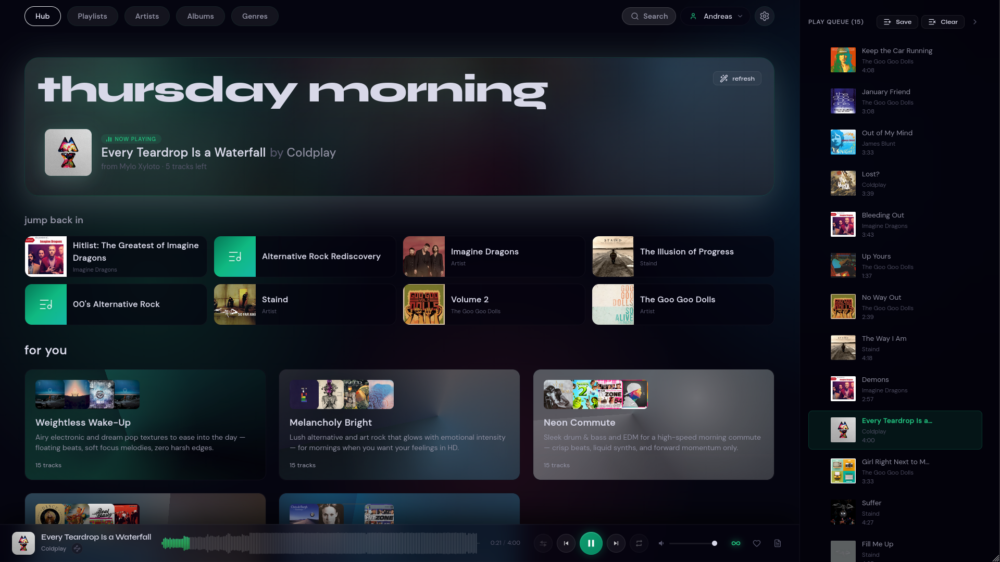
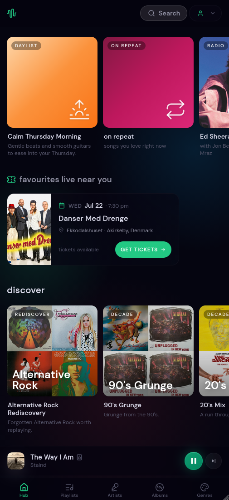
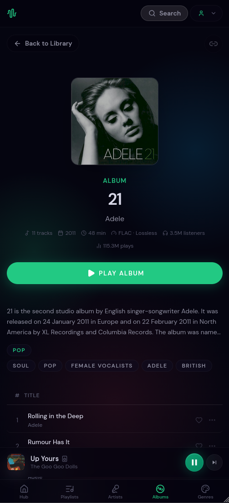
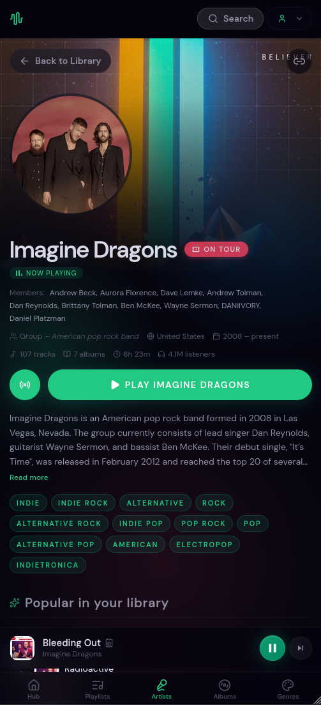
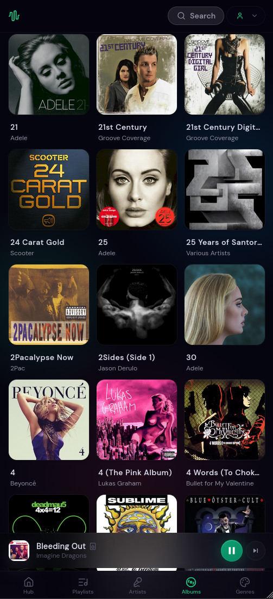
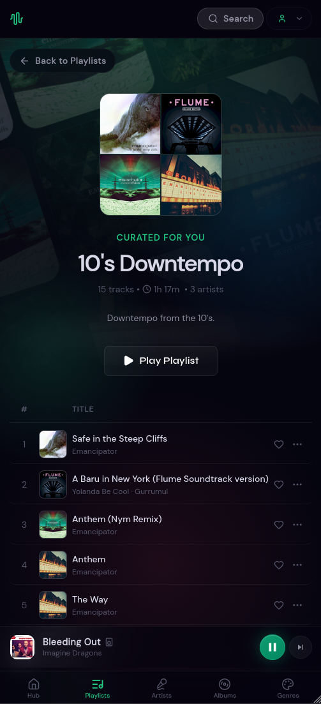
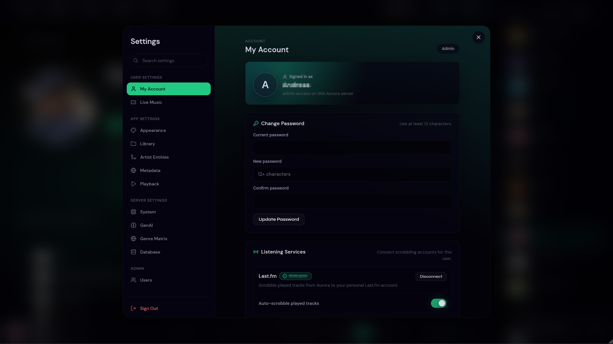

# Aurora Media Server

Aurora is a self-hosted web music player for local libraries. It scans folders on your server, streams your files through a React web app, enriches metadata from external providers, and builds library-aware AI playlists from your own collection.

## Status

Current release: `1.0.0-rc.6`

Aurora is ready for early self-hosted production use. Expect fast iteration and occasional migrations before the first stable `1.0.0` release.

## Screenshots

The Hub is the listener's home: daily mixes, artist radios, and the time-of-day daylist all live here.



The phone layout adapts the same surfaces — Hub, single album, artist detail, albums grid, and playlists — to a portrait, gesture-driven shell.

| Hub | Album | Artist | Albums | Playlists |
| :---: | :---: | :---: | :---: | :---: |
|  |  |  |  |  |

Settings cover library scanning, metadata providers, playback, LLM credentials, and user administration.



## Quick Install

Ubuntu and Debian users can install the runtime dependencies, clone the repository, build the app, create the Python ML environment, and start Aurora under PM2 with:

```bash
curl -fsSL https://raw.githubusercontent.com/destroptor-spec/NorthernLights/main/install.sh | bash
```

Open the URL printed by the installer, create the database from the setup screen, then create the first admin account.

For manual deployment, reverse proxy setup, backups, and update procedures, see [docs/production_guide.md](docs/production_guide.md).

## Features

Aurora is built to feel like a premium music service that happens to run on your own hardware — not just a folder with a play button.

### Playback that respects your files
- **Bit-perfect when you want it, adaptive when you need it.** Play your original files untouched (lossless passthrough for FLAC, ALAC, Opus, WAV, and more) or transcode on the fly across quality tiers, selected automatically from network and device. Broad format support including MP3, FLAC, OGG/Opus, M4A/AAC/ALAC, WAV, and FFmpeg-backed WMA.
- **True gapless transitions** — the next track's stream is prepared in parallel and promoted in milliseconds, not stitched together after a stall.
- **Volume leveling (opt-in).** Loudness normalization measures each track's EBU R128 loudness and evens out volume from track to track — or per album, preserving an album's intended dynamics — with true-peak limiting so nothing clips. No more reaching for the dial between a quiet ballad and a loud master.
- **Full transport, everywhere it matters:** lock-screen / notification / media-key controls with live scrubbing, audio-output device routing, a screen wake lock so the phone won't sleep mid-track, a sleep timer that fades out gently, and automatic resume right where you left off.

### A library that understands your music
- **Three-phase, incremental scanning** that scales to large collections — only changed files are reprocessed, with live progress as it runs.
- **Metadata that usually gets dropped on the floor:** per-role artist credits (composer, producer, remixer, engineer, and more), edition/remaster folding so versions group cleanly, embedded cover art re-encoded to crisp AVIF at multiple sizes, and a real MusicBrainz genre *ontology* instead of flat tags.
- **On-demand enrichment** from Last.fm, MusicBrainz, and Genius for biographies, credits, and artwork.

### Discovery computed from *your* collection
- **Acoustic similarity from real machine-learning embeddings** — MusiCNN acoustic vectors plus 1280-dimension Discogs-EffNet embeddings, indexed with pgvector — so songs are matched by how they actually sound, not by their genre labels.
- **A Hub of auto-curated surfaces:** a time-of-day daylist, on-repeat, a long-tail "repeat rewind," artist radio, decade and genre mixes, and yearly & seasonal **Wrapped** recaps of your top tracks (blended with your Last.fm / ListenBrainz history when connected).
- **AI playlists from a prompt or a mood,** grounded in your own library — with genre-ontology-aware blending, diversity / artist-spread / discovery-bias controls, banned genres, and automatic relaxation when a request is too narrow. Recommendations come from your music's actual audio fingerprint, never a cloud catalog.

### Plays on every screen
- **Installable PWA** with offline replay of tracks you've already played.
- **Chromecast** — cast a single track or a whole queue, losslessly for FLAC/WAV at Source quality, with an optional custom receiver and automatic session recovery if the connection drops.
- **OpenSubsonic-compatible API** with per-user, rotatable API keys, so third-party Subsonic clients work out of the box.

### Connected to the wider ecosystem
- **Scrobbling and now-playing** to Last.fm and ListenBrainz, with clear feedback if a scrobble fails.
- **In-app lyrics**, **live-concert discovery** tied to the artists already in your library, **music videos** on artist pages and the mobile now-playing screen, and MusicBrainz sign-in.
- **Shareable public playlist links** — send a read-only track list to anyone, no account required.

### Built for a household, polished for daily use
- **Multi-user** accounts with roles, invite-based registration, and an admin dashboard; loved tracks, play history, and playlists are all per-user.
- **A modern interface:** a gesture-driven mobile shell, a waveform scrubber, album-art dominant-color theming, light / dark themes with full reduced-motion support, instant global search, and a drag-to-reorder queue.

## Requirements

Minimum recommended server:

- Ubuntu 22.04+ or Debian 12+ for the one-line installer.
- Node.js 20 or newer.
- FFmpeg and ffprobe.
- Podman or Docker for PostgreSQL/pgvector.
- 4 GB RAM minimum, 8 GB+ recommended for larger libraries.
- 4 GB swap recommended on small VPS instances.
- Enough disk for your music, PostgreSQL data, MusicBrainz import work files, and HLS temp files.

The installer uses `uv` to create a Python 3.11 virtual environment for Essentia TensorFlow analysis. Manual installs should do the same.

## Manual Setup

```bash
git clone https://github.com/destroptor-spec/NorthernLights.git
cd NorthernLights
cp .env.example .env
npm ci
curl -LsSf https://astral.sh/uv/install.sh | sh
export PATH="$HOME/.local/bin:$PATH"
uv venv --python 3.11 .venv
uv pip install essentia-tensorflow
npm run build
npx tsx server/index.ts
```

Then open `http://localhost:3001`.

The setup flow will let you create the PostgreSQL container if one is not already running.

## Configuration

Copy `.env.example` to `.env` and review at least:

- `PORT`: default `3001`.
- `ALLOWED_ORIGINS`: comma-separated browser origins allowed by CORS. The example permits both the Vite dev server on `http://localhost:3000` and the built app on `http://localhost:3001`.
- `DB_*`: PostgreSQL connection settings.
- `DB_CONTAINER_NAME` and `DB_DATA_DIR`: managed database container settings.
- `MBDB_WORK_DIR`: temporary MusicBrainz import workspace.
- `SERVER_URL`: public base URL for OAuth callbacks when behind a reverse proxy.
- `CAST_RECEIVER_APP_ID` and `CAST_RECEIVER_ORIGIN`: optional Chromecast custom receiver settings.

Most provider keys and AI settings can also be configured from the app settings UI.

Third-party Subsonic clients should connect to the Aurora base URL and use an API key from Settings -> API Keys. Username/password and token/salt Subsonic auth are intentionally disabled. Admins can disable OpenSubsonic client access from Settings -> System -> Service without deleting existing keys.

## Production

Recommended production shape:

1. Run Aurora as an unprivileged user.
2. Keep PostgreSQL data outside the repo or in a backed-up `DB_DATA_DIR`.
3. Run the Node server with PM2 or systemd.
4. Put Nginx, Caddy, or another TLS reverse proxy in front of port `3001`.
5. Set `SERVER_URL` and `ALLOWED_ORIGINS` to your public HTTPS URL.
6. Back up PostgreSQL data and `.env`.

See [docs/production_guide.md](docs/production_guide.md) for concrete commands.

## Updating

```bash
cd ~/NorthernLights
git pull
npm ci
uv pip install essentia-tensorflow
npm run build
pm2 restart aurora
```

If you use the installer defaults, the PM2 process may be named `aurora` or `northernlights` depending on when it was installed. Check with `pm2 list`.

## Development

```bash
npm install
npm run dev
```

Development runs Vite and the Express server concurrently. Production builds are served by the Express server from `dist/`.

For how the system fits together, see [docs/architecture_overview.md](docs/architecture_overview.md) — including [Library Data Loading](docs/library_data_loading.md), which covers the entity-first / no-full-library-in-memory model that lets the client scale to large collections.

Before submitting changes:

```bash
npx tsc --noEmit
npx vite build
```

## Contributing

Contributions are welcome. Before opening a pull request, read the project guidance so the change fits the product and its conventions:

- [AGENTS.md](AGENTS.md) — project structure, coding standards, and the workflow this repo follows.
- [PRODUCT.md](PRODUCT.md) — what Aurora is, who it's for, and the non-goals that decide what ships.
- [DESIGN.md](DESIGN.md) — the design system: brand, color, typography, glass, and component rules.

Keep pull requests focused. Run typecheck and build before submitting, and prefer extending existing systems over introducing parallel patterns.

[](https://ko-fi.com/X8X51YLFS8)

## License

Copyright (c) 2026 Andreas Destroptor-spec

Permission is hereby granted, free of charge, to any person obtaining a copy
of this software and associated documentation files (the "Software"), to deal
in the Software without restriction, including without limitation the rights
to use, copy, modify, merge, publish, distribute, sublicense, and/or sell
copies of the Software, and to permit persons to whom the Software is
furnished to do so, subject to the following conditions:

The above copyright notice and this permission notice shall be included in all
copies or substantial portions of the Software.

THE SOFTWARE IS PROVIDED "AS IS", WITHOUT WARRANTY OF ANY KIND, EXPRESS OR
IMPLIED, INCLUDING BUT NOT LIMITED TO THE WARRANTIES OF MERCHANTABILITY,
FITNESS FOR A PARTICULAR PURPOSE AND NONINFRINGEMENT. IN NO EVENT SHALL THE
AUTHORS OR COPYRIGHT HOLDERS BE LIABLE FOR ANY CLAIM, DAMAGES OR OTHER
LIABILITY, WHETHER IN AN ACTION OF CONTRACT, TORT OR OTHERWISE, ARISING FROM,
OUT OF OR IN CONNECTION WITH THE SOFTWARE OR THE USE OR OTHER DEALINGS IN THE
SOFTWARE.
