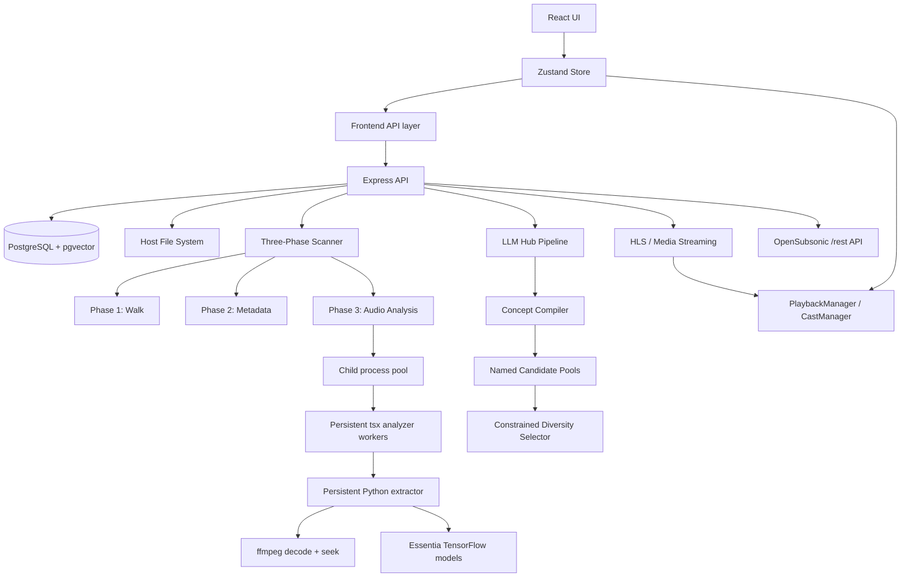

# Architecture Overview

## 1. UI Layer

- **React + TypeScript**
  - Modular UI with Tailwind and shared button classes from `src/index.css`.
- **Zustand**
  - Central store for playback state, library state, and listener settings.
- **PlaybackManager / CastManager**
  - Route playback to local audio or Chromecast while preserving queue identity and playback controls.

## 2. Backend Infrastructure

- **Express**
  - Route modules under `server/routes/` handle auth, library, playback, settings, hub, playlists, entities, media, and OpenSubsonic compatibility.
- **PostgreSQL + pgvector**
  - Stores tracks, entities, settings, listening state, playlists, OpenSubsonic API key hashes, and feature vectors.
- **Filesystem-backed library**
  - Local music folders are scanned and streamed directly from disk.

## 3. Three-Phase Scanner

Aurora’s scanner separates library ingestion into discrete phases:

1. **Walk**
   - Collects file paths recursively.
2. **Metadata**
   - Extracts tags with `music-metadata`.
   - Makes tracks visible quickly.
3. **Analysis**
   - Runs in worker-managed `tsx` child processes.
   - Each worker keeps a persistent Python extractor alive.
   - `ffmpeg` seeks to about 35% into the track and decodes short representative windows.
   - Essentia TensorFlow models extract the recommendation features used by the engine.

This keeps the main server responsive during large library analysis runs.

## 4. Audio Analysis Pipeline

- **Worker manager**
  - `server/workers/processPool.ts`
- **Analyzer child**
  - `server/workers/analyzeTrack.ts`
- **Python extractor**
  - `server/workers/extractor.py`
- **Feature extraction**
  - 8D acoustic semantic vector
  - 1280D Discogs-EffNet embedding
- **Non-ASCII path handling**
  - Temporary symlinks in `/tmp/am-*` avoid decode issues with problematic filenames

## 5. Recommendation Architecture

Aurora now uses a library-relative recommendation engine rather than a simple genre-vs-serendipity split.

### 5.1 Library Profile

The backend computes a cached local-library profile:

- analyzed coverage
- artist entropy
- vector percentiles
- per-genre health

This lets the engine interpret LLM concepts in the context of the actual local collection.

### 5.2 Concept Compiler

Raw LLM concepts are compiled into local plans by `llmConceptCompiler.service.ts`:

- resolve target genre paths
- score path specificity
- measure local genre health
- expand into adjacent supported paths
- adapt target vectors into local percentile space
- sanitize conflicts with banned genres
- reject or regenerate weak broad-only concepts

### 5.3 Named Candidate Pools

The recommender builds explicit pools:

- `core`
- `adjacent`
- `root`
- `acoustic`
- `discovery`
- `bridge`

These pools are measured independently and combined only after deduplication and viability checks.

### 5.4 Recovery Ladder

Weak concepts recover in a fixed order:

1. `exact-path`
2. `adjacent-path`
3. `same-root`
4. `acoustic-similarity`
5. `mood-bridge`
6. `discovery-backfill`

This makes sparse-library behavior deterministic and debuggable.

### 5.5 Final Selector

Playlist selection is constrained rather than top-N:

- no duplicate songs
- artist caps
- album penalties
- genre-root penalties
- acoustic-cluster penalties
- pairwise similarity penalties
- pool-balance targets
- controlled randomness

When reranking collapses despite healthy admissible candidates, the engine falls back to direct admissible selection instead of dropping the playlist.

## 6. Hub Lifecycle

- `GET /api/hub`
  - Fetch existing saved Hub playlists
- `POST /api/hub/regenerate`
  - Generate fresh concepts and playlists
- `POST /api/hub/generate-custom`
  - Build a playlist from a single natural-language prompt

Each generated playlist now emits diagnostics including:

- compiled targets
- genre health
- pool sizes
- relaxation level
- anchor state
- pool mix
- diversity score

## 7. Streaming Architecture

- **Browser playback**
  - HLS playlist generation and local prebuffering via `PlaybackManager`
- **Chromecast**
  - Custom CAF receiver with AAC-in-HLS reliability path
- **Server**
  - FFmpeg-backed HLS session generation in `hlsStream.service.ts`

This keeps one playback architecture for local and cast scenarios while allowing transport-specific behavior where needed.
